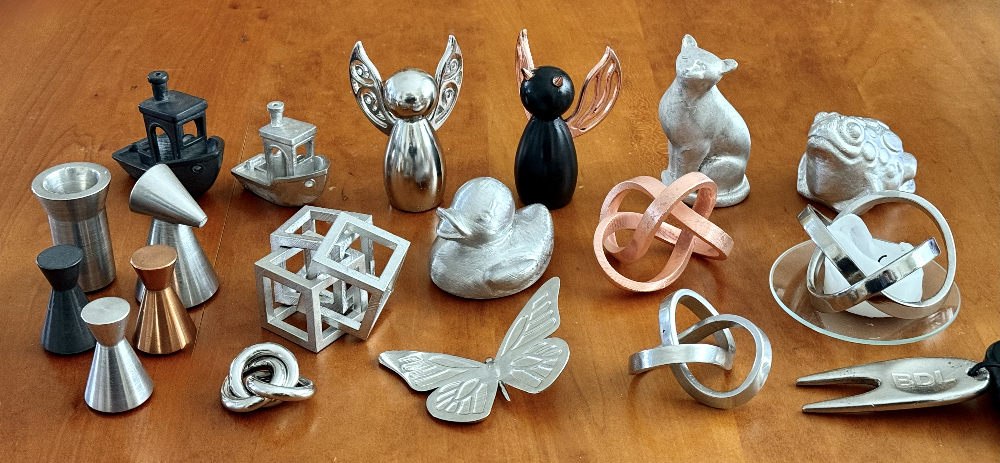

I've been experimenting with directly printing water-soluble molds for
casting metal pieces, with some success. The mold is printed from PVA,
the molten metal is poured into the printed mold, and then the mold is
dissolved away in hot water. This allows very complex shapes to be
cast. I have uploaded some models for printing molds to my
[3d printed molds for metal casting](https://www.printables.com/@BruceLucas_19742/collections/1998490)
collection at printables.com.

It may seem surprising that you can make a metal casting using a
plastic mold, but the metal used is a [low-melting point alloy](https://www.rotometals.com/lead-free-fishing-tackle-weight-bismuth-tin-alloy-281/)
of tin and bismuth (essentially, a relative of pewter), and the metal cools
quickly on contact with the mold before it has a chance to deform.

There are two parts to making a cast metal part from a 3d-printed
mold: designing the mold, and then making the part using the mold.

## Designing the mold

Starting from an STL or other 3d file of a piece that you wish to mold,
the steps are outlined as follows.

* Choose a good orientation for the mold. There are some limitations,
  for example: the piece can't be oriented with any upward-facing
  "pockets" because the mold will then have a downward-facing "finger"
  that can't be supported because you can't put supports inside the
  mold. In most cases though it is possible to find a good orientation
  that avoids this limitation.

* Form the mold, which consists of a hollow body whose outer surface
  is a constant distance away from the piece to be cast and whose
  inner surface is the piece to be cast. The molten alloy will be
  poured into the void in the hollow mold.

* Identify the high points on the piece that will need to be vented so
  that air can escape as metal is poured into the mold, and add the
  vents to the mold.

* Identify a good location to feed the molten metal into the
  piece. Typically I like to use a point somewhere near where the
  piece is angled at around 45 degrees upward, and ideally not on an
  area of critical detail because the remnants of the feed have to be
  filed and sanded off. Then add a channel and a funnel to the mold to
  pour the molten alloy into.

* Design supports for the mold. As mentioned above you can't put
  supports inside the mold, but the good news is that you can add any
  needed support to the outside of the mold without affecting the
  quality of the result. I haven't found supports made by the slicer
  to be completely satisfactory for this application so I design my
  own.

After spending a lot of time designing these elements by hand in a CAD
program, I decided to write an interactive program to semi-automate
this process using various open-source mesh processing libraries. It's
not ready for general use, but if there's interest I'll try to clean
up the worst of the rough edges and post it here.

## Making the part

The steps are outlined as follows. These steps are desribed detail
[here](MAKING.md).

* Slicing. This requires selecting the correct infill and perimeter
  settings, as well as appropriately selecting and tweaking the
  filament and printer profiles.

* Printing the mold, including bed prep for getting good adhesion with
  PVA.

* Melting and pouring, including appropriate temperature of molten
  alloy and use of water bath to help cool the part and ensure that
  the mold doesn't sag before the metal solidifies.

* Dissolving the mold. While PVA is water soluble, it does so slowly,
  and patience together with some thermal and mechanical encouragement
  are needed.

* Finishing the part, including removing the vents and feed, filing,
  sanding, polishing, and applying surface finishes.
  

